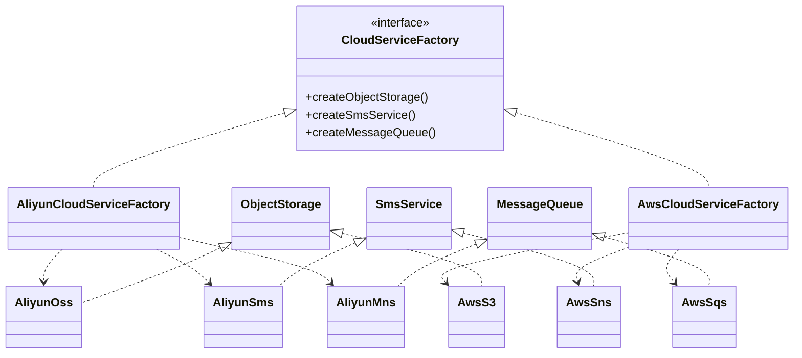

### 抽象工厂模式 (Abstract Factory Pattern) - 创建一整套相关的产品族

#### 1. 💡 场景映射

- **解决什么痛点**：当业务中需要创建的不是单一对象，而是**一组相互依赖、风格一致的对象**（如同一云厂商的对象存储 + 短信 + 消息队列），如果在代码里分别 `new AliyunOss()`、`new AliyunSms()`、`new AliyunMns()`，会导致三个问题：
  1. 同一厂商的初始化参数（ak/sk/region）重复传递，容易遗漏或写错；
  2. 切换云厂商时，需要逐处修改创建逻辑；
  3. 不同厂商的产品混用（如阿里云 OSS + AWS SNS）可能引发兼容性 bug。

- **真实业务场景**：
  1. **SaaS 多云部署平台**：国内部署用阿里云全家桶（OSS + 短信 + MNS），海外部署用 AWS 全家桶（S3 + SNS + SQS），通过抽象工厂一键切换。
  2. **跨境电商平台**：不同国家需要不同的“支付 + 物流 + 税务”服务族，例如中国用支付宝+顺丰+电子发票，欧洲用 Stripe+DHL+VAT，抽象工厂保证同一区域使用同一套服务。
  3. **金融风控系统**：不同交易所需要不同的“行情 + 订单 + 风控”接口族，抽象工厂隔离交易所差异。

- **JDK/Spring源码印证**：
  - `javax.xml.parsers.DocumentBuilderFactory#newInstance()` 根据系统配置返回不同厂商的 DOM 解析器族。
  - `java.sql.Connection` + `Statement` + `ResultSet` 可视为 JDBC 驱动提供的数据库访问产品族，不同数据库驱动就是不同的具体工厂。
  - Spring 的 `DataSource` + `PlatformTransactionManager` + `JdbcTemplate` 经常作为一组数据库访问族被配置和注入。
  - Java AWT 的 `Toolkit` 会根据操作系统返回不同的 GUI 组件族。

---

#### 2. 🛠️ 实战代码演练

- **UML类图描述**：



- **核心代码实现**：见 `src/main/java/com/pattern/abstractfactory/`
  - `CloudServiceFactory`：抽象工厂，定义产品族创建接口。
  - `ObjectStorage / SmsService / MessageQueue`：抽象产品。
  - `AliyunCloudServiceFactory / AwsCloudServiceFactory`：具体工厂。
  - `AliyunOss / AliyunSms / AliyunMns`：阿里云产品族。
  - `AwsS3 / AwsSns / AwsSqs`：AWS 产品族。
  - `SaaSPlatform`：客户端，依赖抽象工厂和抽象产品。

- **客户端调用示例**：见 `src/main/java/com/pattern/abstractfactory/AbstractFactoryDemo.java`

- **运行方式**：
  ```bash
  mvn -pl abstract-factory compile exec:java \
      -Dexec.mainClass="com.pattern.abstractfactory.AbstractFactoryDemo"
  ```
  或：
  ```bash
  java -cp abstract-factory/target/classes com.pattern.abstractfactory.AbstractFactoryDemo
  ```

---

#### 3. ⚖️ 架构师点评

- **适用边界**：
  - 系统需要创建**多个相互关联、相互依赖**的对象，且这些对象构成一个完整的产品族。
  - 需要保证同一产品族中的对象一起使用，避免不同族的对象混用。
  - 系统需要在多个产品族之间切换，例如根据部署环境、租户、区域切换。

- **反模式警告**：
  - **不要为单一产品使用抽象工厂**：如果只需要创建一种对象，用工厂方法或简单工厂即可，抽象工厂会引入不必要的复杂度。
  - **不要过度拆分产品族**：如果两个产品之间没有强关联，硬塞进同一个工厂会导致工厂接口膨胀。
  - **不要忽视新增产品类型的代价**：抽象工厂一旦新增一个抽象产品方法，所有具体工厂都要修改，这是该模式最大的缺点。

- **性能/复杂度影响**：
  - 增加了系统的抽象层次和类的数量，适合中大型项目；小型项目会显得笨重。
  - 产品族的切换在运行时通过替换工厂实例完成，几乎没有运行时开销。
  - 便于/mock测试：可以为测试环境创建一套内存中的 Mock 产品族工厂。

- **现代替代方案**：
  1. **Spring 配置类 + Profile**：用 `@Configuration` + `@Profile("aliyun")` / `@Profile("aws")` 定义不同的产品族 Bean，由容器根据环境注入，本质上是抽象工厂的 IOC 化。
  2. **依赖注入 + 接口多实现**：如果产品族之间的差异不大，可以直接注入多个接口的实现集合，用策略模式动态选择。
  3. **Builder + 配置对象**：当重点是组装复杂初始化参数时，Builder 模式比抽象工厂更灵活。
  4. **函数式工厂表**：`Map<String, CloudServiceFactory>` 配合 lambda，适合产品族确定、无需严格继承结构的场景。

---

#### 4. 🎯 面试/实战速记口诀

> **“一族产品一起造，切换厂商只改厂；新增产品伤筋动骨，Spring Profile 是良方。”**
