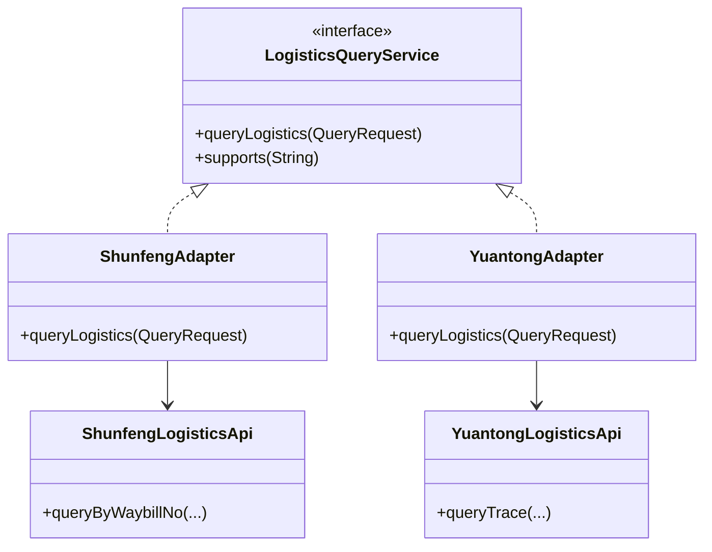

### 适配器模式 (Adapter Pattern) - 让不兼容的接口协同工作

#### 1. 💡 场景映射

- **解决什么痛点**：当系统需要集成多个第三方服务或遗留系统时，它们的接口、参数顺序、返回格式往往各不相同。如果在业务代码里直接调用这些异构 API，会出现大量 `if-else`、字段映射和格式转换，导致业务逻辑被污染。适配器模式通过引入一个中间层，把外部接口转换成内部统一的接口，让上层业务只依赖一个稳定的抽象。

- **真实业务场景**：
  1. **电商物流查询平台**：顺丰、圆通、中通等物流公司 API 各不相同，通过适配器统一为 `LogisticsQueryService`，订单详情页无需关心底层承运商差异。
  2. **聚合支付回调处理**：微信、支付宝、银联的回调报文格式、签名字段、状态码定义都不一样，用适配器统一解析为标准 `PaymentCallback`。
  3. **多消息队列接入**：Kafka、RocketMQ、RabbitMQ 的消费接口各异，通过适配器统一为内部 `MessageConsumer`。
  4. **旧系统迁移**：新系统定义了新接口，但部分模块仍需调用老系统的旧接口，用适配器包一层实现平滑过渡。

- **JDK/Spring源码印证**：
  - `java.io.InputStreamReader` 和 `OutputStreamWriter` 是字节流与字符流之间的适配器。
  - `java.util.Arrays#asList()` 把数组适配为 List 接口。
  - `java.util.Collections` 中的各种包装方法（如 `synchronizedList`、`unmodifiableList`）本质上是集合适配器。
  - Spring MVC 的 `HandlerAdapter` 把不同类型的 Controller（如 `@Controller`、`HttpRequestHandler`、`Servlet`）适配为统一的处理器调用方式。
  - SLF4J 绑定层把 `org.slf4j.Logger` 适配到 Log4j、Logback、JUL 等具体实现。

---

#### 2. 🛠️ 实战代码演练

- **UML类图描述**：



- **核心代码实现**：见 `src/main/java/com/pattern/adapter/`
  - `LogisticsQueryService`：目标接口，定义内部统一的物流查询契约。
  - `ShunfengLogisticsApi / YuantongLogisticsApi`：已存在的第三方 API（adaptee）。
  - `ShunfengAdapter / YuantongAdapter`：适配器，把第三方 API 转换为 `LogisticsQueryService`。
  - `LogisticsPlatform`：客户端，依赖目标接口。

- **客户端调用示例**：见 `src/main/java/com/pattern/adapter/AdapterDemo.java`

- **运行方式**：
  ```bash
  mvn -pl adapter compile exec:java \
      -Dexec.mainClass="com.pattern.adapter.AdapterDemo"
  ```
  或：
  ```bash
  java -cp adapter/target/classes com.pattern.adapter.AdapterDemo
  ```

---

#### 3. ⚖️ 架构师点评

- **适用边界**：
  - 需要复用现有类，但其接口与目标接口不兼容。
  - 需要集成多个第三方服务或遗留系统，统一对外暴露内部接口。
  - 希望隔离外部 API 的变化，避免污染业务代码。
  - 需要支持未来新增的外部系统，而无需修改现有业务代码（开闭原则）。

- **反模式警告**：
  - **不要把适配器当成业务逻辑容器**：适配器只应做接口转换、字段映射、异常翻译，不应包含业务规则。
  - **不要无限堆叠适配器**：A 适配 B，B 适配 C，C 适配 D，多层适配会让调试和链路追踪变得困难。
  - **不要忽视性能开销**：如果适配层涉及大量对象转换或远程调用包装，要评估对延迟的影响。
  - **不要为了统一而统一**：如果两个外部接口差异极小，直接封装一个工具类可能比引入适配器更简单。

- **性能/复杂度影响**：
  - 适配器本身通常只是薄薄一层字段映射，运行时开销可忽略。
  - 主要成本是增加了一个抽象层和更多的类文件；收益是业务代码与外部系统解耦。
  - 如果适配层包含数据转换（如 JSON/XML 互转、加解密），则会有额外的计算开销。

- **现代替代方案**：
  1. **防腐层（Anti-Corruption Layer, DDD）**：适配器模式在领域驱动设计中的进化版，不仅做接口转换，还负责领域模型映射和边界隔离。
  2. **策略模式 + 工厂方法**：如果差异主要在于算法/行为而非接口，用策略模式更合适。
  3. **Facade 模式**：如果是为了简化一组复杂接口的调用，用外观模式而非适配器。
  4. **OpenFeign / RestTemplate 拦截器**：在微服务中，HTTP 客户端库本身就可以做请求/响应适配。

---

#### 4. 🎯 面试/实战速记口诀

> **“外部接口不兼容，中间包一层来转换；只换接口不动业务，防腐隔离最可靠。”**
