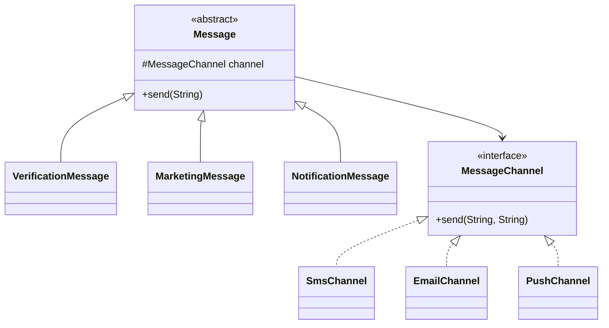

### 桥接模式 (Bridge Pattern) - 把抽象和实现解耦，让它们独立变化

#### 1. 💡 场景映射

- **解决什么痛点**：当一个类存在两个或多个独立变化的维度时（例如“消息类型”和“发送渠道”），如果采用继承方式组合所有可能，会产生类爆炸（M × N 个类）。而且任何一个维度新增一种类型，都要修改大量现有代码。桥接模式通过**组合**替代继承，把抽象和实现分离，使它们可以独立扩展。

- **真实业务场景**：
  1. **消息通知平台**：消息类型包括验证码、营销、通知；发送渠道包括短信、邮件、APP 推送。用桥接模式可以让“新增渠道”和“新增消息类型”互不干扰。
  2. **支付 × 风控**：支付方式（微信、支付宝、银联）和风控策略（简单校验、规则引擎、AI 模型）是两个独立维度，桥接后可以自由组合。
  3. **报表导出**：导出格式（PDF、Excel、CSV）和数据源（数据库、缓存、第三方 API）独立变化，桥接后避免格式类依赖数据源。
  4. **图形渲染引擎**：图形类型（圆、矩形、三角形）和渲染引擎（OpenGL、DirectX、Skia）通过桥接解耦。

- **JDK/Spring源码印证**：
  - Java AWT 的 `Component`（抽象）与 `Peer`（实现）就是桥接模式的早期应用。
  - JDBC 的 `DriverManager` 与具体数据库驱动之间，抽象（Connection/Statement）与实现（MySQL/PostgreSQL 驱动）分离。
  - Spring 的 `JmsTemplate`（抽象）与 `ConnectionFactory`（实现）可以看作桥接思想。
  - SLF4J 的 `Logger`（抽象）与底层绑定（Logback、Log4j2）也是桥接的体现。

---

#### 2. 🛠️ 实战代码演练

- **UML类图描述**：



- **核心代码实现**：见 `src/main/java/com/pattern/bridge/`
  - `MessageChannel`：实现化角色，定义发送渠道契约。
  - `SmsChannel / EmailChannel / PushChannel`：具体实现化角色。
  - `Message`：抽象化角色，持有 `MessageChannel` 引用。
  - `VerificationMessage / MarketingMessage / NotificationMessage`：扩展抽象化角色，各自组装内容。
  - `MessageService`：客户端，组合抽象与实现。

- **客户端调用示例**：见 `src/main/java/com/pattern/bridge/BridgeDemo.java`

- **运行方式**：
  ```bash
  mvn -pl bridge compile exec:java \
      -Dexec.mainClass="com.pattern.bridge.BridgeDemo"
  ```
  或：
  ```bash
  java -cp bridge/target/classes com.pattern.bridge.BridgeDemo
  ```

---

#### 3. ⚖️ 架构师点评

- **适用边界**：
  - 类存在两个或多个独立变化的维度，且需要避免静态继承带来的类爆炸。
  - 希望抽象部分和实现部分可以独立扩展、独立演化。
  - 实现部分需要完全隐藏，客户端只与抽象交互。
  - 需要在运行时动态切换实现（例如根据配置切换短信服务商）。

- **反模式警告**：
  - **不要为单一维度用桥接**：如果只有一个变化维度，直接用策略模式或简单继承即可。
  - **不要把所有组合都抽象成桥接**：过度桥接会导致层次过多，代码碎片化。
  - **不要让抽象层做太多事情**：抽象层应只负责组装/委托，具体发送逻辑应在实现层。
  - **不要混淆桥接和策略**：策略模式封装的是 interchangeable 的算法；桥接模式强调的是两个独立维度可以独立变化。

- **性能/复杂度影响**：
  - 桥接模式用组合替代继承，几乎没有运行时性能损失。
  - 主要成本是增加了一个抽象层；收益是彻底消除 M×N 类爆炸。
  - 在依赖注入框架（如 Spring）中，桥接模式非常自然，因为框架本身就在做“抽象依赖具体实现”的装配。

- **现代替代方案**：
  1. **依赖注入（Spring）**：把 `MessageChannel` 作为依赖注入到 `MessageService` 中，本质上就是桥接模式的工程化。
  2. **策略模式**：当只有一个维度变化时，用策略模式更简单。
  3. **函数式组合**：使用 `Function<String, String>` 表示内容组装，`Consumer<String>` 表示发送渠道，用高阶函数组合。
  4. **模板方法模式**：如果不同消息类型的差异是固定流程中的某几步，模板方法可能比桥接更直观。

---

#### 4. 🎯 面试/实战速记口诀

> **“两个维度独立变，组合代替继承链；抽象实现各一层，M×N 变 M+N。”**
