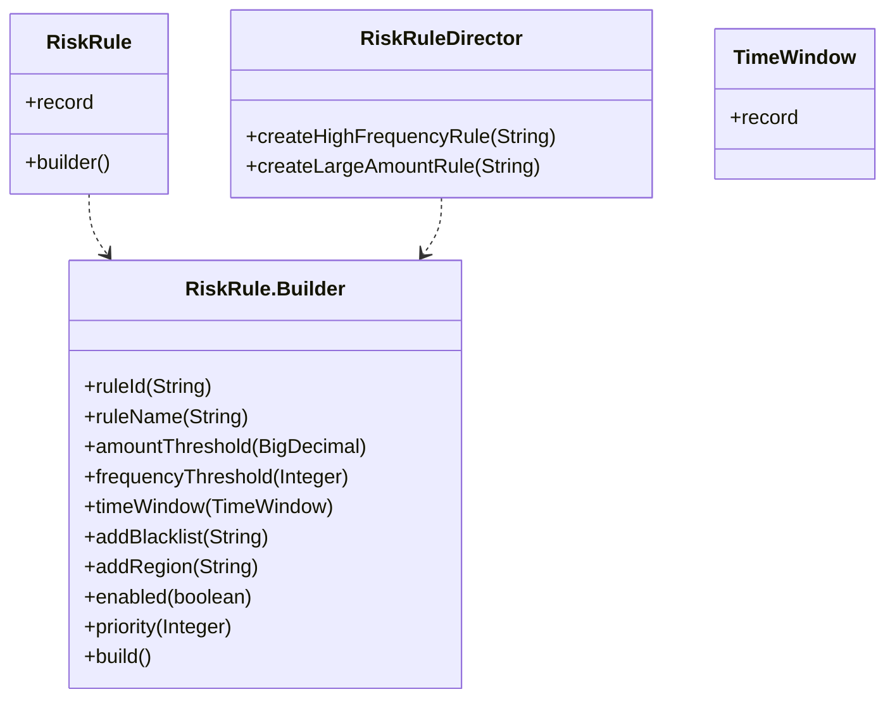

### 建造者模式 (Builder Pattern) - 分步骤组装复杂对象

#### 1. 💡 场景映射

- **解决什么痛点**：当一个对象有十几个甚至几十个字段，其中只有部分是必填、部分是可选时，你会面临三种坏味道：
  1. **重叠构造器（Telescoping Constructor）**：`new RiskRule(id, name)`、`new RiskRule(id, name, amount)`、`new RiskRule(id, name, amount, frequency)`... 构造器数量指数级增长，参数顺序容易写错。
  2. **JavaBean 式 setters**：对象创建后可变，线程不安全，容易漏设字段。
  3. **Map/JSON 随意传参**：类型安全丧失，编译期无法校验。

- **真实业务场景**：
  1. **金融风控规则配置**：一条规则可能包含规则 ID、名称、金额阈值、频次阈值、时间窗口、黑名单、适用地区、优先级、启用状态等十几个字段，且不同场景必填项不同。
  2. **电商商品发布**：商品对象包含标题、类目、价格、库存、SKU、运费模板、图片、属性、SEO 信息等，用 Builder 可以清晰地区分必填和可选。
  3. **中间件请求构建**：如 OkHttp 的 `Request.Builder`、Spring 的 `UriComponentsBuilder`，都是建造者模式的经典应用。

- **JDK/Spring源码印证**：
  - `java.lang.StringBuilder` / `StringBuffer` 是建造者模式的变体，用于逐步拼接字符串。
  - `java.util.stream.Collectors` 中的复杂收集器也采用分步构建思想。
  - OkHttp 的 `Request.Builder`、`Response.Builder` 是典型的 fluent Builder。
  - Spring 的 `UriComponentsBuilder`、`MockMvcRequestBuilders` 也是 Builder 模式。
  - MyBatis 的 `SQL` 类提供 `SELECT`、`FROM`、`WHERE` 等逐步构建 SQL 的方法。

---

#### 2. 🛠️ 实战代码演练

- **UML类图描述**：



- **核心代码实现**：见 `src/main/java/com/pattern/builder/`
  - `RiskRule`：使用 Java 17 `record` 作为不可变产品，内部定义 `Builder`。
  - `RiskRule.Builder`：提供 fluent API 逐步组装规则，并在 `build()` 中校验必填字段。
  - `TimeWindow`：辅助 Record，表示时间窗口。
  - `RiskRuleDirector`：指挥者，封装常见规则的预配置构建流程。

- **客户端调用示例**：见 `src/main/java/com/pattern/builder/BuilderDemo.java`

- **运行方式**：
  ```bash
  mvn -pl builder compile exec:java \
      -Dexec.mainClass="com.pattern.builder.BuilderDemo"
  ```
  或：
  ```bash
  java -cp builder/target/classes com.pattern.builder.BuilderDemo
  ```

---

#### 3. ⚖️ 架构师点评

- **适用边界**：
  - 对象字段较多（通常超过 4 ~ 5 个），且存在大量可选参数。
  - 对象创建后应当是不可变的（线程安全、可安全传递）。
  - 对象的创建需要校验业务规则，希望在构建时一次性完成校验。
  - 需要生成不同“风味”的对象，Director 模式很适合。

- **反模式警告**：
  - **不要为只有 2 ~ 3 个字段的对象用 Builder**：直接写构造器或静态工厂方法更简洁。
  - **不要让 Builder 持有可变集合后原样暴露**：应在 `build()` 时做防御性拷贝，否则“不可变产品”就失效了。
  - **不要忽视 `build()` 校验**：Builder 的价值之一就是集中校验，如果不在 build 时校验，就只是把 setters 换了一种写法。
  - **不要过度使用 Director**：如果构建步骤本身经常变化，Director 会让修改成本上升。

- **性能/复杂度影响**：
  -  Builder 会带来额外的内部类和一些临时对象，但现代 JVM 几乎可以忽略这些开销。
  - 主要成本是类文件增多和代码量增加；收益是**可读性、可维护性、不可变性**。
  - 对于高频创建的小对象，如果性能极其敏感，可能需要评估；但绝大多数业务系统收益远大于成本。

- **现代替代方案**：
  1. **Lombok `@Builder`**：自动生成 Builder，代码极简，是 Java 企业开发中最常见的做法。
  2. **Java Record + 拷贝方法**：对于变化较少的对象，可以用 `withXxx()` 方法返回新 record。
  3. **MapStruct / Bean Mapping**：如果对象是从 DTO/Entity 转换而来，用映射工具比手写 Builder 更高效。
  4. **JSON/YAML 配置 + 校验框架**：对于纯配置类对象，直接用 `@ConfigurationProperties` + JSR-303 校验更自然。

---

#### 4. 🎯 面试/实战速记口诀

> **“字段多、可选多、构造器爆炸，分步构建最优雅；Lombok 一键生成，Director 预设常用法。”**
