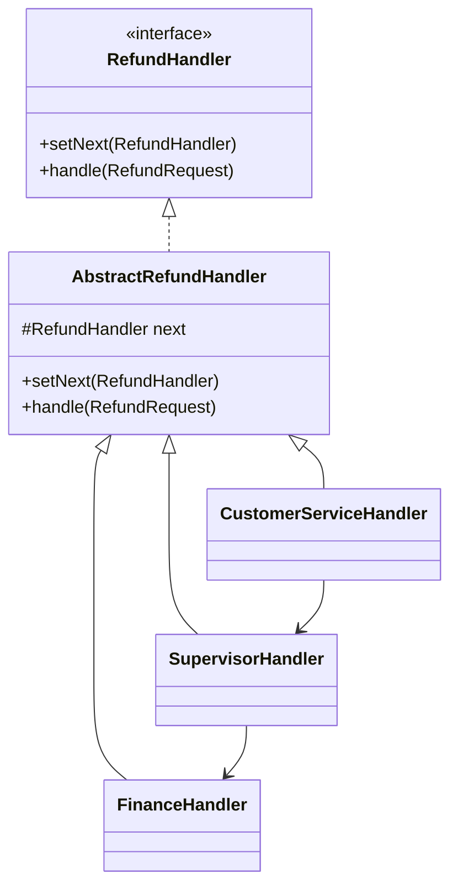

### 责任链模式 (Chain of Responsibility Pattern) - 让多个对象有机会处理请求

#### 1. 💡 场景映射

- **解决什么痛点**：当一个请求需要经过多个处理步骤，但具体由哪个步骤处理取决于请求内容时，如果写一堆 `if-else` 判断，会导致代码难以维护和扩展。责任链模式把处理器串成一条链，请求在链上传递，直到某个处理器决定处理它，从而解耦请求发送者和接收者。

- **真实业务场景**：
  1. **电商售后退款审批**：小额退款客服直接审批，中等金额需主管审批，大额需财务审批，形成审批链。
  2. **优惠券校验链**：依次校验有效期、使用门槛、适用范围、互斥规则，任一环节失败就终止。
  3. **Spring 过滤器链 / 拦截器链**：HTTP 请求依次经过认证、鉴权、限流、日志等过滤器处理。
  4. **日志级别处理**：DEBUG → INFO → WARN → ERROR，根据日志级别找到合适的处理器。

- **JDK/Spring源码印证**：
  - `java.util.logging.Logger` 的日志传播机制体现了责任链思想。
  - Java Servlet 的 `FilterChain` 是责任链模式的典型应用。
  - Spring Security 的 `FilterChainProxy` 把多个 `SecurityFilter` 串成链。
  - OkHttp 的 `Interceptor.Chain` 也使用了责任链模式处理请求和响应。

---

#### 2. 🛠️ 实战代码演练

- **UML类图描述**：



- **核心代码实现**：见 `src/main/java/com/pattern/chain/`
  - `RefundHandler`：处理器接口。
  - `AbstractRefundHandler`：抽象处理器，提供链式传递基础。
  - `CustomerServiceHandler / SupervisorHandler / FinanceHandler`：具体处理器。
  - `RefundHandlerChain`：负责组装链并启动处理。
  - `RefundRequest / RefundResult`：Java 17 Record。

- **客户端调用示例**：见 `src/main/java/com/pattern/chain/ChainOfResponsibilityDemo.java`

- **运行方式**：
  ```bash
  mvn -pl chain-of-responsibility compile exec:java \
      -Dexec.mainClass="com.pattern.chain.ChainOfResponsibilityDemo"
  ```
  或：
  ```bash
  java -cp chain-of-responsibility/target/classes com.pattern.chain.ChainOfResponsibilityDemo
  ```

---

#### 3. ⚖️ 架构师点评

- **适用边界**：
  - 多个对象可以处理同一请求，但具体由谁处理在运行时才确定。
  - 希望动态指定处理顺序或处理者集合。
  - 不想把请求发送者和接收者硬编码耦合。
  - 流程中的每一步都有可能终止或继续传递。

- **反模式警告**：
  - **不要让链过长**：链太长会导致调试困难，请求可能在链中“迷路”。
  - **不要忘记处理无处理器的情况**：如果链尾没有默认处理器，请求可能不被处理。
  - **不要把责任链变成硬编码的 if-else**：如果只是静态顺序判断，直接写 `if-else` 或策略模式更直观。
  - **不要混用职责**：每个处理器只应负责一个明确的判定规则。

- **性能/复杂度影响**：
  - 链式调用有轻微的栈开销，通常可忽略。
  - 主要风险是链过长导致延迟增加和调试困难。
  - 优点是可以动态增删处理节点，符合开闭原则。

- **现代替代方案**：
  1. **Spring 拦截器 / FilterChain**：Web 层处理横切关注点时，框架内置的过滤器链比手写责任链更常用。
  2. **规则引擎**：当判定逻辑复杂且经常变化时，Drools / EasyRules 比责任链更灵活。
  3. **状态机**：如果处理流程有明确状态和转移，状态机比责任链更合适。
  4. **函数式组合**：用 `List<Predicate<T>>` 或 `Stream` 配合 `findFirst` 实现轻量级责任链。

---

#### 4. 🎯 面试/实战速记口诀

> **“请求沿着链上走，谁能处理谁接手；避免 if-else 堆成山，拦截器里最常见。”**
