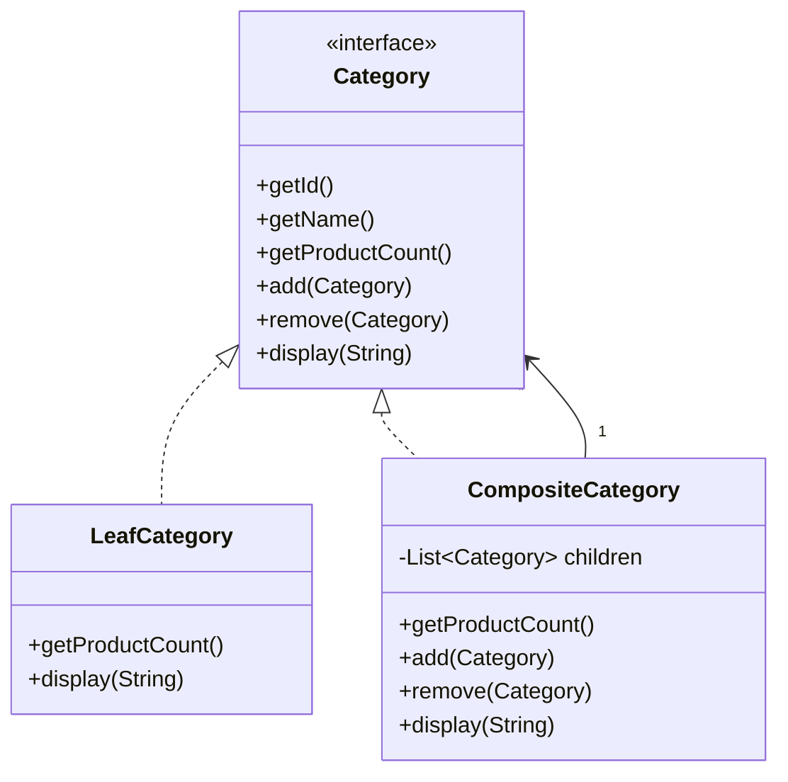

### 组合模式 (Composite Pattern) - 让单个对象和组合对象被一致对待

#### 1. 💡 场景映射

- **解决什么痛点**：当业务中存在“整体-部分”的树形结构时（如类目树、组织架构、菜单树），如果客户端代码需要分别处理“叶子节点”和“组合节点”，会产生大量 `instanceof` 判断和递归逻辑。组合模式通过统一接口，让叶子和组合对外表现一致，客户端可以像处理单个对象一样处理整棵树。

- **真实业务场景**：
  1. **电商商品类目树**：平台有“数码家电”这样的组合类目，也有“iPhone”这样的叶子类目。需要统一计算每个类目下的商品总数、统一渲染类目导航树。
  2. **企业组织架构**：公司由部门和员工组成树形结构，需要统一计算部门人数、统一计算部门薪资成本。
  3. **权限系统菜单树**：系统菜单、子菜单、页面按钮组成层级结构，需要统一进行授权校验和前端渲染。
  4. **审批流程定义**：流程节点、条件分支、并行分支等组成的树形结构，需要统一遍历和执行。

- **JDK/Spring源码印证**：
  - `java.awt.Container` 和 `java.awt.Component` 是组合模式的经典应用，Container 可以包含 Component，两者都继承自 Component。
  - `javax.swing.JComponent` / `JPanel` / `JFrame` 同样使用组合模式构建 UI 组件树。
  - Java 集合框架中的 `java.util.Collection` 及其子接口可以视为组合模式，`addAll` 等方法统一处理单个元素和集合。
  - Spring Security 的 `FilterChainProxy` 中的 `SecurityFilterChain` 列表可以看作过滤器组合。

---

#### 2. 🛠️ 实战代码演练

- **UML类图描述**：



- **核心代码实现**：见 `src/main/java/com/pattern/composite/`
  - `Category`：组件接口，定义叶子和组合的公共行为。
  - `LeafCategory`：叶子节点，代表无子类目的末端类目。
  - `CompositeCategory`：组合节点，包含子类目列表，递归汇总商品数量。
  - `CategoryService`：客户端，统一处理 `Category` 接口，不区分叶子与组合。

- **客户端调用示例**：见 `src/main/java/com/pattern/composite/CompositeDemo.java`

- **运行方式**：
  ```bash
  mvn -pl composite compile exec:java \
      -Dexec.mainClass="com.pattern.composite.CompositeDemo"
  ```
  或：
  ```bash
  java -cp composite/target/classes com.pattern.composite.CompositeDemo
  ```

---

#### 3. ⚖️ 架构师点评

- **适用边界**：
  - 业务对象可以表示成树形结构，且存在“整体-部分”关系。
  - 希望客户端忽略叶子节点和组合节点的差异，统一使用同一接口。
  - 需要对整个树做统一操作（如统计、遍历、渲染、权限校验）。

- **反模式警告**：
  - **不要把组件接口设计得过于臃肿**：如果叶子节点被迫实现很多无意义的方法（如 `getChildren()`），会破坏接口隔离原则。可以用默认方法抛异常，或拆分子接口。
  - **不要忽视类型安全**：组合模式有时需要在运行时判断节点类型，应谨慎使用 `instanceof`，尽量保持接口统一。
  - **不要用于非树形结构**：如果对象之间没有层级包含关系，组合模式只会增加不必要的抽象。
  - **不要嵌套过深**：层级过深的组合树会增加遍历和调试难度。

- **性能/复杂度影响**：
  - 组合模式用递归汇总数据时，深度较大的树可能带来栈深度或性能问题。
  - 对于读多写少的树，可以在组合节点缓存商品数量等派生数据，避免每次重新计算。
  - 代码复杂度主要体现在维护树结构和递归算法；收益是客户端代码大幅简化。

- **现代替代方案**：
  1. **扁平化结构 + 路径字段**：在数据库中用 `parent_id` 或 `path` 字段存储层级，查询时用 CTE（递归 SQL）或应用层组装，避免内存中维护复杂树。
  2. **访问者模式**：当需要对树执行多种不同操作时，用访问者模式把操作和结构分离。
  3. **Stream API 递归展平**：用 Java Stream 配合递归函数处理树形集合，代码更函数式。
  4. **ORM 嵌套集合**：如 MyBatis 的嵌套结果映射可以直接把数据库层级映射为对象树。

---

#### 4. 🎯 面试/实战速记口诀

> **“整体部分一棵树，叶子组合同接口；递归统计又遍历，统一调用不区分。”**
