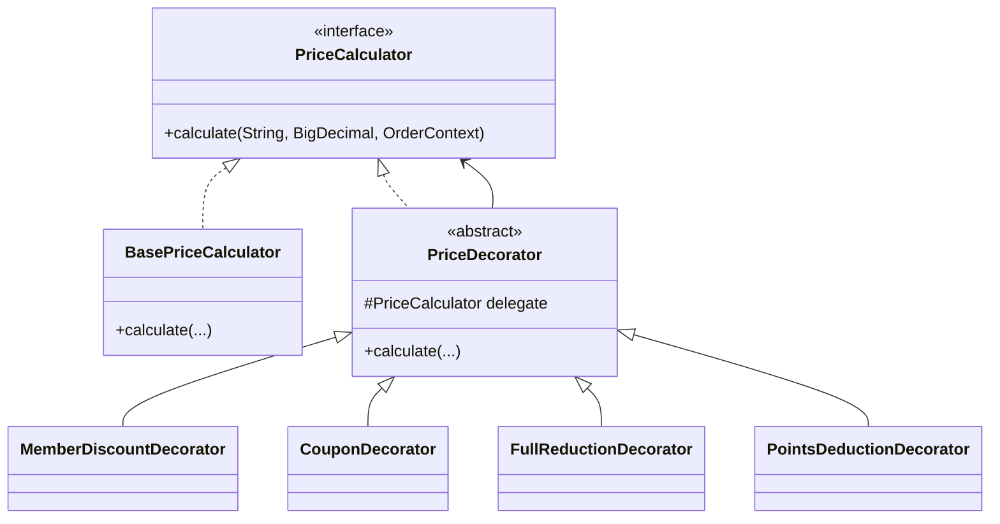

### 装饰器模式 (Decorator Pattern) - 动态地给对象添加职责

#### 1. 💡 场景映射

- **解决什么痛点**：当需要给一个对象增加功能时，如果使用继承，每增加一种功能组合就要新建一个子类，导致类爆炸；而且这些功能是运行时才确定的，静态继承无法灵活组合。装饰器模式通过**包装**现有对象，在运行时动态叠加职责，既不影响原有对象，又能自由组合各种功能。

- **真实业务场景**：
  1. **电商促销价格计算**：基础价格 → 会员折扣 → 满减 → 优惠券 → 积分抵扣，各种优惠以装饰器方式层层叠加。
  2. **HTTP 请求处理链**：基础请求 → 日志记录 → 鉴权 → 限流 → 重试，每个处理步骤都是一个装饰器。
  3. **数据访问层缓存**：DAO → 本地缓存装饰 → Redis 缓存装饰，按需要叠加缓存策略。
  4. **Java I/O 流**：`FileInputStream` → `BufferedInputStream` → `DataInputStream` 是 JDK 中最经典的装饰器模式应用。

- **JDK/Spring源码印证**：
  - `java.io` 包中 `InputStream` / `OutputStream` / `Reader` / `Writer` 及其子类是装饰器模式的教科书案例。
  - `java.util.Collections` 中的 `synchronizedXXX`、`unmodifiableXXX`、`checkedXXX` 都是装饰器。
  - Spring 的 `TransactionAwareDataSourceProxy`、`DataSourceUtils` 等也是装饰思想的体现。
  - Spring Security 的 `FilterChainProxy` 通过过滤器链层层包装请求，与装饰器模式异曲同工。

---

#### 2. 🛠️ 实战代码演练

- **UML类图描述**：



- **核心代码实现**：见 `src/main/java/com/pattern/decorator/`
  - `PriceCalculator`：组件接口，定义价格计算契约。
  - `BasePriceCalculator`：具体组件，返回原价。
  - `PriceDecorator`：抽象装饰器，持有 `PriceCalculator` 引用。
  - `MemberDiscountDecorator / CouponDecorator / FullReductionDecorator / PointsDeductionDecorator`：具体装饰器，分别实现会员折扣、优惠券、满减、积分抵扣。
  - `PromotionEngine`：客户端，负责按业务规则组装装饰器链。

- **客户端调用示例**：见 `src/main/java/com/pattern/decorator/DecoratorDemo.java`

- **运行方式**：
  ```bash
  mvn -pl decorator compile exec:java \
      -Dexec.mainClass="com.pattern.decorator.DecoratorDemo"
  ```
  或：
  ```bash
  java -cp decorator/target/classes com.pattern.decorator.DecoratorDemo
  ```

---

#### 3. ⚖️ 架构师点评

- **适用边界**：
  - 需要在运行时动态、透明地给对象添加职责。
  - 职责可以任意组合，且组合顺序可能影响结果。
  - 不想通过继承导致子类爆炸。
  - 需要保持原有对象接口不变，对客户端透明。

- **反模式警告**：
  - **不要把装饰器写成继承**：装饰器的关键是“持有并委托”，如果装饰器没有委托给被装饰对象，就不是装饰器。
  - **不要忽视顺序问题**：`先打折再满减` 和 `先满减再打折` 结果可能不同，业务上必须明确顺序。
  - **不要过度嵌套**：装饰器链过长会导致调试困难，性能敏感场景要评估调用栈深度。
  - **不要与代理模式混淆**：代理模式控制对象访问；装饰器模式增强对象功能。二者结构相似，意图不同。

- **性能/复杂度影响**：
  - 每次调用都会经过装饰器链，链越长调用开销越大，但通常只是方法调用和简单计算，可忽略。
  - 主要风险是装饰顺序和重复装饰（例如同一优惠被应用两次），需要在设计时通过 idempotency 或状态管理避免。

- **现代替代方案**：
  1. **责任链模式（Chain of Responsibility）**：当每个装饰器都需要决定是否继续处理时，责任链比装饰器更合适。
  2. **AOP（Spring Aspect）**：通过切面在方法前后织入日志、鉴权、事务等横切关注点，比手写装饰器更声明式。
  3. **函数式组合**：使用 `Function<BigDecimal, BigDecimal>` 或 `UnaryOperator` 把每个优惠表示为函数，用 `andThen` 组合。
  4. **规则引擎**：当促销规则非常复杂且经常变化时，引入 Drools / EasyRules 等规则引擎比装饰器链更可维护。

---

#### 4. 🎯 面试/实战速记口诀

> **“动态加职责不继承，层层包装像穿衣；顺序不同结果异，AOP 也是近亲。”**
