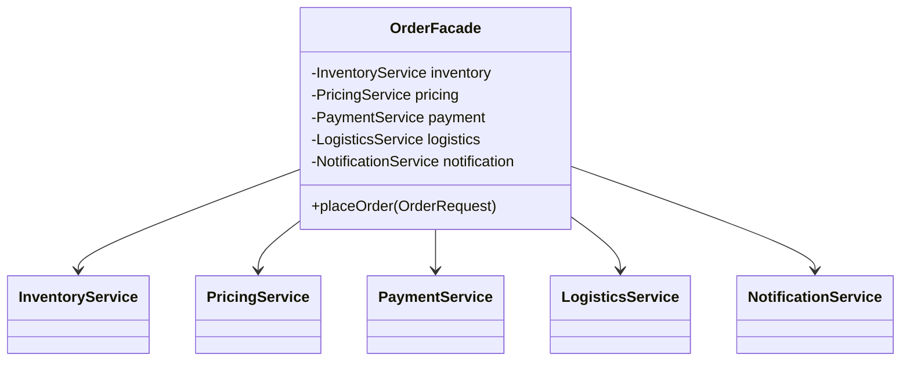

### 外观模式 (Facade Pattern) - 为复杂子系统提供统一简化的入口

#### 1. 💡 场景映射

- **解决什么痛点**：当一个业务操作需要协调多个子系统（如库存、价格、支付、物流、通知）时，如果客户端直接调用每个子系统，会面临：
  1. 调用顺序复杂，容易遗漏或写错；
  2. 客户端与多个子系统耦合，子系统变更会蔓延到所有客户端；
  3. 业务入口不统一，新人难以快速理解完整流程。

- **真实业务场景**：
  1. **电商下单服务**：下单需要校验库存、计算价格、使用优惠券、扣减库存、发起支付、创建物流单、发送通知。外观模式封装一个 `OrderFacade.placeOrder()`，上层只需传一个请求对象。
  2. **支付网关**：对外提供统一的 `pay()` 接口，内部封装鉴权、风控、路由、渠道调用、对账、通知等子系统。
  3. **文件上传服务**：封装文件校验、转码、生成缩略图、上传对象存储、刷新 CDN 等复杂步骤。
  4. **应用启动**：Spring Boot 的 `SpringApplication.run()` 就是外观模式，隐藏了环境准备、Bean 加载、内嵌容器启动等复杂过程。

- **JDK/Spring源码印证**：
  - `java.net.URL` 可以看作访问网络资源的简化外观，隐藏了协议处理细节。
  - `java.util.Collections` 提供了一组静态方法作为集合操作的外观。
  - Spring 的 `JdbcTemplate` 是 JDBC 编程的外观，隐藏了 Connection、Statement、ResultSet 的获取和关闭。
  - Spring Boot 的 `SpringApplication` 是启动流程的外观。
  - MyBatis 的 `SqlSessionFactory` 和 `SqlSession` 也是复杂底层操作的外观。

---

#### 2. 🛠️ 实战代码演练

- **UML类图描述**：



- **核心代码实现**：见 `src/main/java/com/pattern/facade/`
  - `OrderFacade`：外观类，统一封装下单流程。
  - `InventoryService / PricingService / PaymentService / LogisticsService / NotificationService`：子系统。
  - `OrderRequest / OrderResult`：Java 17 Record，简化请求和响应。

- **客户端调用示例**：见 `src/main/java/com/pattern/facade/FacadeDemo.java`

- **运行方式**：
  ```bash
  mvn -pl facade compile exec:java \
      -Dexec.mainClass="com.pattern.facade.FacadeDemo"
  ```
  或：
  ```bash
  java -cp facade/target/classes com.pattern.facade.FacadeDemo
  ```

---

#### 3. ⚖️ 架构师点评

- **适用边界**：
  - 系统有多个复杂子系统，需要为外部提供统一入口。
  - 希望降低客户端与子系统之间的耦合。
  - 需要分层架构，明确边界（如 Controller → Facade → Service）。
  - 需要简化测试、文档和 onboarding 成本。

- **反模式警告**：
  - **不要把外观类变成上帝类**：外观负责流程编排，不应包含业务规则；业务逻辑应下沉到子系统。
  - **不要完全禁止客户端直接访问子系统**：外观是“便捷入口”不是“唯一入口”，高级场景仍可直接使用子系统。
  - **不要在一个外观里做分布式事务**：外观可以协调，但分布式事务应由 Saga、TCC、Seata 等专门机制处理。
  - **不要与中介者模式混淆**：外观是单向简化调用；中介者是多个对象之间的复杂交互协调。

- **性能/复杂度影响**：
  - 外观层只是方法调用转发，几乎没有性能开销。
  - 主要收益是降低系统复杂度和耦合度；风险是外观类过大成为维护热点。
  - 在微服务中，外观模式常用于 BFF（Backend for Frontend）层或聚合服务层。

- **现代替代方案**：
  1. **BFF / API Gateway**：在微服务架构中，网关或 BFF 层承担外观职责，聚合多个下游服务。
  2. **Spring Service 层**：一个 `@Service` 注入多个 Repository/Client，天然就是外观模式。
  3. **Command / Saga 模式**：当下单流程涉及分布式事务和长时间运行时，用 Saga 替代简单外观。
  4. **工作流引擎**：当流程复杂且经常变化时，使用 Camunda / Activiti 等工作流引擎比硬编码外观更灵活。

---

#### 4. 🎯 面试/实战速记口诀

> **“子系统再多也不怕，一个门面统天下；编排流程不抢业务，BFF 网关都用它。”**
