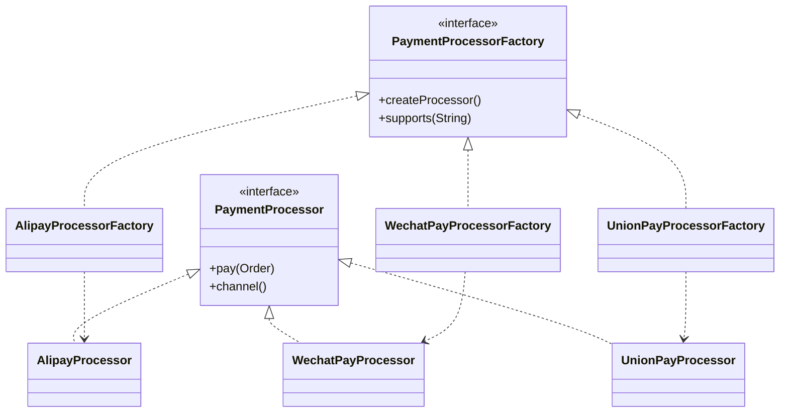

### 工厂方法模式 (Factory Method Pattern) - 把对象创建交给子类决定

#### 1. 💡 场景映射

- **解决什么痛点**：当业务中存在一组相似但初始化逻辑不同的对象（如不同支付渠道、不同报表生成器、不同消息队列客户端），如果直接在业务代码里写满 `if-else` 或 `switch` 来 `new` 对象，会导致创建逻辑与业务逻辑耦合，新增渠道时必须修改原有代码，违反开闭原则。

- **真实业务场景**：
  1. **电商聚合支付系统**：支付宝、微信支付、银联的 SDK 初始化参数完全不同（appId、mchId、证书路径等），使用工厂方法可以让每个渠道拥有独立的创建工厂。
  2. **金融报表导出中心**：PDF、Excel、CSV 三种报表生成器需要加载不同的模板引擎和字体库，工厂方法把创建逻辑从报表服务中剥离。
  3. **中间件消息队列适配**：Kafka、RocketMQ、RabbitMQ 的生产者初始化参数各异，工厂方法让每种 MQ 拥有独立的创建工厂，便于统一封装与切换。

- **JDK/Spring源码印证**：
  - `java.util.Calendar#getInstance()` 可视为工厂方法，返回不同 locale 的 Calendar 子类。
  - `java.nio.charset.Charset#forName(String)` 根据名称创建不同字符集实例。
  - Spring 的 `FactoryBean<T>` 接口是典型的工厂方法扩展，`SqlSessionFactoryBean`、`JedisConnectionFactory` 都实现了它。
  - SLF4J 的 `LoggerFactory#getLogger(Class)` 根据底层绑定返回不同 Logger 实现。

---

#### 2. 🛠️ 实战代码演练

- **UML类图描述**：



- **核心代码实现**：见 `src/main/java/com/pattern/factorymethod/`
  - `PaymentProcessor`：使用 `sealed interface` 约束产品族（Java 17 特性）。
  - `AlipayProcessor / WechatPayProcessor / UnionPayProcessor`：具体产品。
  - `PaymentProcessorFactory`：工厂接口。
  - `AlipayProcessorFactory / WechatPayProcessorFactory / UnionPayProcessorFactory`：具体工厂。
  - `PaymentService`：客户端，依赖工厂接口而非具体实现。

- **客户端调用示例**：见 `src/main/java/com/pattern/factorymethod/FactoryMethodDemo.java`

- **运行方式**：
  ```bash
  mvn -pl factory-method compile exec:java \
      -Dexec.mainClass="com.pattern.factorymethod.FactoryMethodDemo"
  ```
  或：
  ```bash
  java -cp factory-method/target/classes com.pattern.factorymethod.FactoryMethodDemo
  ```

---

#### 3. ⚖️ 架构师点评

- **适用边界**：
  - 当一个类无法预见它需要创建的对象的类时（如框架需要扩展点）。
  - 当一个类希望由其子类来指定所创建的对象时。
  - 当创建逻辑复杂且多变，需要与使用逻辑解耦时。
  - 在 Spring 中，当某个 Bean 的创建过程需要复杂配置时，优先使用 `FactoryBean`。

- **反模式警告**：
  - **不要为每个简单对象都建工厂**：如果只是一种对象、创建逻辑只有一行 `new`，直接 `new` 即可，不要为了模式而模式。
  - **不要让工厂方法膨胀**：如果产品族数量爆炸且初始化逻辑差异不大，考虑抽象工厂 + 配置化，而不是无限增加具体工厂。
  - **不要和简单工厂混淆**：简单工厂是一个类根据参数返回不同对象，而工厂方法是把创建延迟到子类，二者解决的问题层级不同。

- **性能/复杂度影响**：
  - 增加了一层抽象，类数量会翻倍（每个产品对应一个工厂），对小型项目有认知负担。
  - 运行时几乎没有额外开销，因为创建对象本身就需要这些初始化步骤。
  - 便于单元测试：可以通过注入 mock 工厂来隔离依赖。

- **现代替代方案**：
  1. **依赖注入容器（Spring IOC）**：由容器根据配置和类型自动创建 Bean，本质上是工厂方法的超集。
  2. **函数式工厂**：使用 `Map<String, Supplier<PaymentProcessor>>` 或 `Function<String, PaymentProcessor>` 做简单的策略路由，代码更紧凑。
  3. **抽象工厂模式**：当存在多个产品族（如支付处理器 + 支付回调解析器 + 支付对账器）时，升级为抽象工厂。
  4. **Builder 模式**：如果创建对象的重点是“一步步组装复杂参数”，用 Builder 比工厂方法更自然。

---

#### 4. 🎯 面试/实战速记口诀

> **“创建逻辑太杂乱，交给子类来承载；新增渠道不改旧，开闭原则自然在。”**
