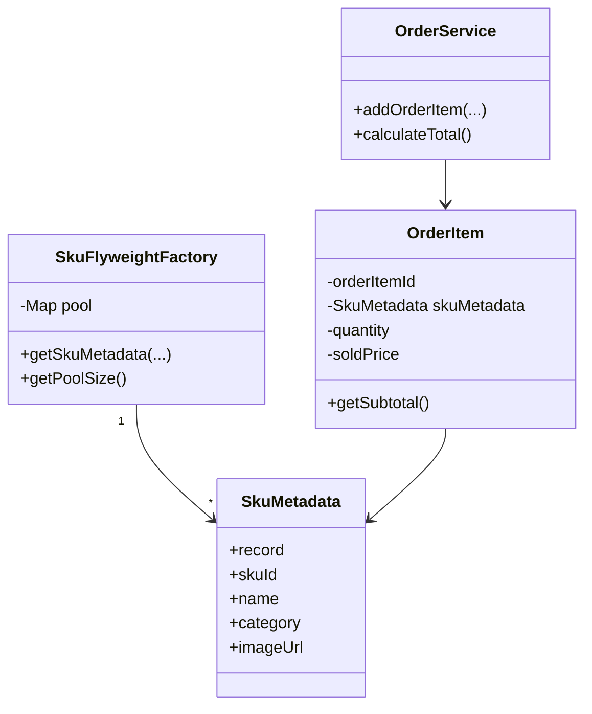

### 享元模式 (Flyweight Pattern) - 共享细粒度对象以节省内存

#### 1. 💡 场景映射

- **解决什么痛点**：当系统中存在大量相似对象时，如果每个对象都独立保存全部数据，会造成严重内存浪费。享元模式把对象状态拆分为**内部状态（intrinsic）**和**外部状态（extrinsic）**：内部状态可以共享，外部状态由使用时传入。通过共享内部状态，大幅减少对象数量。

- **真实业务场景**：
  1. **电商订单 SKU 元数据**：一个爆款 SKU 可能出现在几十万订单项中。SKU 的名称、类目、图片等元数据是内部状态，可以共享；而数量、成交价、订单号是外部状态，每个订单项独立持有。
  2. **在线文档/富文本编辑器**：每个字符的位置、样式是外部状态，而字符的字形（Glyph）是内部状态，可以共享。
  3. **游戏引擎粒子系统**：相同纹理的粒子共享同一份纹理对象，位置、速度、生命值是外部状态。
  4. **地图瓦片渲染**：相同类型的地图瓦片共享同一份图形资源。

- **JDK/Spring源码印证**：
  - `java.lang.Integer#valueOf(int)` 对 -128 ~ 127 的整数使用缓存（类似享元）。
  - `java.lang.String#intern()` 把字符串放入常量池共享。
  - Java 字符集 `Charset` 实例会被缓存复用。
  - 数据库连接池 / 线程池虽然不是严格享元，但共享对象的思想一致。

---

#### 2. 🛠️ 实战代码演练

- **UML类图描述**：



- **核心代码实现**：见 `src/main/java/com/pattern/flyweight/`
  - `SkuMetadata`：享元对象（内部状态），Java Record 不可变共享。
  - `SkuFlyweightFactory`：享元工厂，使用 `ConcurrentHashMap` 缓存并按 skuId 复用。
  - `OrderItem`：包含共享的 `SkuMetadata` 和外部状态（数量、成交价）。
  - `OrderService`：客户端，创建订单项时复用 SKU 元数据。

- **客户端调用示例**：见 `src/main/java/com/pattern/flyweight/FlyweightDemo.java`

- **运行方式**：
  ```bash
  mvn -pl flyweight compile exec:java \
      -Dexec.mainClass="com.pattern.flyweight.FlyweightDemo"
  ```
  或：
  ```bash
  java -cp flyweight/target/classes com.pattern.flyweight.FlyweightDemo
  ```

---

#### 3. ⚖️ 架构师点评

- **适用边界**：
  - 系统中存在大量重复对象，且内存占用成为瓶颈。
  - 对象的大部分状态可以剥离为外部状态。
  - 对象创建成本较高，复用能显著提升性能。
  - 内部状态相对稳定，不会频繁变化。

- **反模式警告**：
  - **不要为了省内存而滥用享元**：现代 JVM 内存管理已经很高效，对象数量不爆炸时没必要引入享元。
  - **不要混淆享元与对象池**：对象池管理的是可重用的完整对象（如连接池）；享元共享的是对象的内部状态，外部状态由调用方提供。
  - **不要忽视线程安全**：享元对象通常被多线程共享，必须是不可变或线程安全的。
  - **不要让享元工厂无限增长**：如果 SKU 数量极大，缓存池本身会占用大量内存，需要配合 LRU 等淘汰策略。

- **性能/复杂度影响**：
  - 显著降低内存占用，特别是当大量对象共享相同内部状态时。
  - 需要维护工厂和缓存，增加代码复杂度。
  - 外部状态的传递和管理需要仔细设计，否则容易引入 bug。
  - 可能增加 CPU 开销（查表、计算外部状态），但通常远小于内存收益。

- **现代替代方案**：
  1. **对象池（Object Pool）**：如果对象创建销毁成本高但不需要共享状态，用对象池更合适。
  2. **缓存（Cache）**：如果重点是避免重复查询数据库，Redis / Caffeine 等缓存比手写享元更常见。
  3. **不可变对象 + 静态工厂**：如 `Integer.valueOf()`，由 JDK 自动处理小范围共享。
  4. **数据库端去重**：如果元数据来自数据库，通过合理的查询和映射，让同一实体只加载一次（JPA 一级缓存）。

---

#### 4. 🎯 面试/实战速记口诀

> **“大量对象内存炸，内外状态拆开来；内部共享外部传入，工厂缓存省空间。”**
