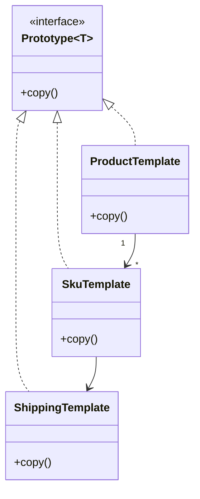

### 原型模式 (Prototype Pattern) - 通过复制现有对象来创建新对象

#### 1. 💡 场景映射

- **解决什么痛点**：当创建对象的成本较高（需要查询数据库、计算复杂状态、组装多个子对象），且新对象与已有对象高度相似时，如果每次都重新构造，会浪费性能；如果直接引用原对象又会导致副作用。原型模式通过**复制**现有对象来快速生成新实例，既避免重复构造，又保证新实例独立可修改。

- **真实业务场景**：
  1. **电商商品模板克隆**：运营维护一套标准商品模板（含 SKU、属性、图片、运费模板），商家上架时基于模板克隆，仅修改标题、价格、SKU 编码等少量字段即可发布。
  2. **金融保单/合同复制**：基于标准保单模板生成新保单，保留通用条款，只调整投保人、保额、受益人等个性化信息。
  3. **工作流/审批流模板**：企业中有固定审批流程模板，发起新流程时克隆模板并填充具体业务数据。
  4. **图形/仿真系统中的对象快照**：保存某一时刻的对象状态，后续基于快照恢复或分支演化。

- **JDK/Spring源码印证**：
  - `java.lang.Object#clone()` 和 `java.lang.Cloneable` 是 JDK 提供的原型机制（尽管设计上有争议）。
  - `java.util.ArrayList#clone()`、`java.util.HashMap#clone()` 等方法实现了浅拷贝。
  - Spring 的 `BeanUtils.copyProperties` 和 `SerializationUtils.clone` 都体现了对象复制的思想。
  - MyBatis 的 `CacheKey` 等对象在需要时会基于现有对象复制出新实例。

---

#### 2. 🛠️ 实战代码演练

- **UML类图描述**：



- **核心代码实现**：见 `src/main/java/com/pattern/prototype/`
  - `Prototype<T>`：自定义原型接口，声明 `copy()` 方法。
  - `ShippingTemplate`：嵌套引用对象，演示深拷贝。
  - `SkuTemplate`：具体原型，包含集合和嵌套对象，展示深拷贝实现。
  - `ProductTemplate`：复合原型，包含多个 SKU，递归深拷贝。
  - `ProductTemplateService`：模板服务，封装“注册模板 → 克隆新品”的业务流程。

- **客户端调用示例**：见 `src/main/java/com/pattern/prototype/PrototypeDemo.java`

- **运行方式**：
  ```bash
  mvn -pl prototype compile exec:java \
      -Dexec.mainClass="com.pattern.prototype.PrototypeDemo"
  ```
  或：
  ```bash
  java -cp prototype/target/classes com.pattern.prototype.PrototypeDemo
  ```

---

#### 3. ⚖️ 架构师点评

- **适用边界**：
  - 对象创建成本高，且新对象与现有对象结构高度相似。
  - 需要避免与原型对象共享可变状态（因此深拷贝通常必不可少）。
  - 对象的类层次结构复杂，使用 `new` 构造器会暴露过多细节。
  - 需要保存对象中间状态并基于它继续演化（如撤销/重做、分支流程）。

- **反模式警告**：
  - **不要用 JDK 的 `Cloneable` 接口**：它是个标记接口，语义不明确，且 `Object.clone()` 是 protected，强制使用容易写出浅拷贝 bug。
  - **不要只做浅拷贝**：如果原型包含集合、Map 或嵌套对象，浅拷贝会导致克隆对象修改影响原对象。
  - **不要为简单对象用原型**：如果对象只有三两个字段且创建成本极低，直接 `new` 或拷贝构造器更简单。
  - **不要忘记 final 字段**：final 字段在拷贝后无法修改，设计原型类时要提前考虑。

- **性能/复杂度影响**：
  - 深拷贝比浅拷贝更安全，但实现成本更高，尤其是嵌套层次深或包含循环引用时。
  - 原型模式避开了复杂构造过程，通常比重新构造性能更好。
  - 代码复杂度主要体现在正确实现深拷贝；漏拷一个集合就可能引入隐蔽 bug。

- **现代替代方案**：
  1. **拷贝构造器 / 工厂方法**：Java 社区更推荐显式 `new Obj(original)` 或 `obj.copy()`，比 `Cloneable` 更清晰。
  2. **序列化深拷贝**：通过 `ObjectOutputStream` / `ObjectInputStream` 或 Kryo 等库实现全自动深拷贝，适合对象图复杂的场景。
  3. **不可变对象 + `withXxx` 方法**：如 Java Record 配合 `withName(...)` 返回新实例，既安全又避免拷贝陷阱。
  4. **Lombok `@Builder(toBuilder = true)`**：自动生成 builder，可以基于现有对象快速创建修改后的副本。
  5. **MapStruct / BeanUtils**：用于 DTO/Entity 之间的字段拷贝，但不保证深拷贝，需要谨慎。

---

#### 4. 🎯 面试/实战速记口诀

> **“创建成本高、结构又相近，复制一份再改动；深拷贝是底线，Cloneable 不建议用。”**
