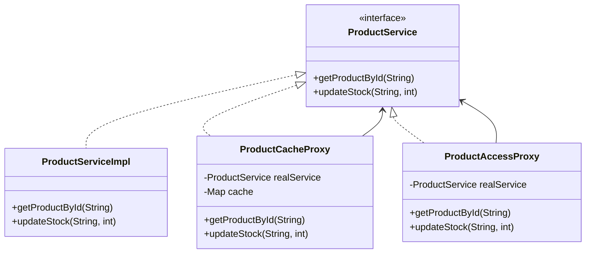

### 代理模式 (Proxy Pattern) - 控制对对象的访问

#### 1. 💡 场景映射

- **解决什么痛点**：有时我们不希望客户端直接访问目标对象，而是希望在访问前后加入一些控制逻辑，例如权限校验、缓存、日志、延迟加载、远程通信等。如果把这些逻辑直接塞进目标对象，会导致职责混乱且难以复用。代理模式引入一个代理对象，与目标对象实现相同接口，客户端对代理发起调用，代理再决定是否转发给目标对象。

- **真实业务场景**：
  1. **商品详情缓存代理**：商品详情查询很耗时，代理层先查本地缓存，命中则直接返回，未命中再访问数据库并回写缓存。
  2. **权限保护代理**：库存修改等敏感操作只允许管理员执行，代理层在调用真实服务前校验当前用户权限。
  3. **RPC 远程代理**：Dubbo、gRPC 等框架为远程服务生成本地代理，客户端像调用本地方法一样调用远程服务。
  4. **Hibernate 懒加载代理**：访问关联对象时，代理负责在真正使用时才从数据库加载数据。
  5. **日志/监控代理**：在方法调用前后记录耗时、参数、返回值，用于可观测性。

- **JDK/Spring源码印证**：
  - JDK 动态代理 `java.lang.reflect.Proxy` 是 Java 内置的代理实现机制。
  - CGLIB 通过生成子类实现代理，被 Spring AOP 广泛使用。
  - Spring AOP 的 `@Transactional`、`@Cacheable`、`@PreAuthorize` 本质上都是代理模式。
  - Hibernate 使用 Javassist 生成懒加载代理对象。
  - MyBatis 的 Mapper 接口由 JDK 动态代理实现。

---

#### 2. 🛠️ 实战代码演练

- **UML类图描述**：



- **核心代码实现**：见 `src/main/java/com/pattern/proxy/`
  - `ProductService`：主题接口。
  - `ProductServiceImpl`：真实主题，模拟数据库查询。
  - `ProductCacheProxy`：缓存代理，加速读操作并在写操作时失效缓存。
  - `ProductAccessProxy`：保护代理，校验修改权限。
  - `ProductServiceClient`：客户端，只依赖 `ProductService` 接口。

- **客户端调用示例**：见 `src/main/java/com/pattern/proxy/ProxyDemo.java`

- **运行方式**：
  ```bash
  mvn -pl proxy compile exec:java \
      -Dexec.mainClass="com.pattern.proxy.ProxyDemo"
  ```
  或：
  ```bash
  java -cp proxy/target/classes com.pattern.proxy.ProxyDemo
  ```

---

#### 3. ⚖️ 架构师点评

- **适用边界**：
  - 需要在访问目标对象前后添加控制逻辑（缓存、权限、日志、事务、限流等）。
  - 目标对象创建成本高或访问成本高，需要延迟加载或远程代理。
  - 需要隐藏目标对象的实现细节或网络位置。
  - 需要对目标对象进行解耦，便于扩展横切关注点。

- **反模式警告**：
  - **不要让代理包含业务逻辑**：代理只应做控制层面的增强，业务逻辑应留在真实主题。
  - **不要滥用代理导致调用链过长**：多层代理叠加会让堆栈变深、调试困难。
  - **不要忽视代理带来的副作用**：例如缓存代理可能导致数据不一致，必须设计好失效策略。
  - **不要与装饰器模式混淆**：装饰器目的是增强功能；代理目的是控制访问。结构相似，意图不同。

- **性能/复杂度影响**：
  - 代理模式本身只是方法转发，性能开销极小。
  - 缓存代理能显著降低下游压力；权限代理增加了安全检查开销但可忽略。
  - 动态代理（JDK/CGLIB）在运行时生成字节码，会有少量类加载和反射开销，但现代 JVM 已高度优化。

- **现代替代方案**：
  1. **Spring AOP + 注解**：用 `@Cacheable`、`@Transactional`、`@PreAuthorize` 等声明式注解替代手写代理。
  2. **拦截器 / 过滤器链**：在 Web 层或 RPC 层使用拦截器实现日志、鉴权、限流。
  3. **函数式装饰**：用 `Function` / `UnaryOperator` 包装方法调用，适合简单场景。
  4. **服务网格（Service Mesh）**：在微服务架构中，Sidecar 代理（如 Istio）在基础设施层统一处理流量控制、安全、观测。

---

#### 4. 🎯 面试/实战速记口诀

> **“不直接访问目标对象，代理中间加把锁；缓存权限和日志，AOP 是最高效做法。”**
