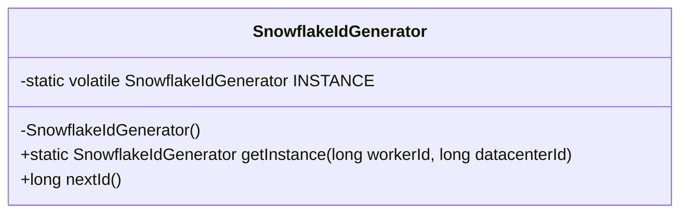

### 单例模式 (Singleton Pattern) - 全局唯一实例的受控入口

#### 1. 💡 场景映射

- **解决什么痛点**：当系统中某个对象只需要存在一个实例时（如配置中心客户端、连接池、全局缓存），如果没有受控机制，业务代码里会到处是 `new XxxClient()`，导致连接泄漏、配置不一致、资源浪费，甚至触发分布式环境下的竞态条件。

- **真实业务场景**：
  1. **电商订单号的分布式 ID 生成器**：雪花算法生成器需要维护机器 ID、序列号等状态，必须全局唯一，否则可能产生重复订单号。
  2. **金融系统配置中心客户端**：如 Nacos/Apollo 客户端，频繁创建会导致注册中心连接风暴，单例可保证只维持一条长连接。
  3. **SaaS 平台的全局限流器/令牌桶**：限流状态必须在进程内统一维护，多个实例会导致限流失效。

- **JDK/Spring源码印证**：
  - `java.lang.Runtime#getRuntime()` 是典型的饿汉单例。
  - Spring 容器中默认作用域为 `singleton`，底层由 `DefaultSingletonBeanRegistry` 维护单例池。
  - `java.util.Calendar#getInstance()` 等工厂方法内部也常复用单例或享元对象。

---

#### 2. 🛠️ 实战代码演练

- **UML类图描述**：



- **核心代码实现**：见 `src/main/java/com/pattern/singleton/SnowflakeIdGenerator.java`

- **客户端调用示例**：见 `src/main/java/com/pattern/singleton/SingletonDemo.java`

- **运行方式**：
  ```bash
  mvn -pl singleton exec:java -Dexec.mainClass="com.pattern.singleton.SingletonDemo"
  ```
  或直接运行 `SingletonDemo#main`。

---

#### 3. ⚖️ 架构师点评

- **适用边界**：
  - 资源创建成本高、状态需全局一致、且生命周期应与 JVM 共存的对象，如数据库连接池、配置客户端、序列生成器。
  - 无状态或只读的服务对象，配合 Spring 容器使用时，交给 IOC 管理比手写单例更自然。

- **反模式警告**：
  - **不要为可变状态对象做单例**：如果单例持有用户会话、请求上下文等可变数据，会引发内存泄漏和线程安全问题。
  - **不要在分布式系统中默认“单例”**：进程内单例不等于集群单例，分布式锁/协调服务（ZooKeeper、Redis RedLock）才是集群维度的唯一性保证。
  - **不要手写单例后再到处 `getInstance()`**：这是“隐藏的全局变量”，会让单元测试和 Mock 异常困难。

- **性能/复杂度影响**：
  - 双重检查锁只会在首次创建时同步，后续获取几乎是零开销。
  - 认知负担在于：一旦引入单例，所有依赖它的代码都暗含了全局状态假设，排查 bug 时需要跨调用链追踪。

- **现代替代方案**：
  1. **Spring IOC 容器**：Bean 默认单例，由容器统一管理生命周期，天然避免手写 DCL。
  2. **枚举单例**（`public enum Singleton { INSTANCE; }`）：由 JVM 保证唯一性，且能防御反射和序列化攻击，是 Joshua Bloch 推荐的最简洁实现。
  3. **静态内部类**（Initialization-on-demand holder）：兼顾懒加载和无锁，实现比 DCL 更优雅。
  4. **函数式依赖注入**：在纯函数式模块中，把实例作为参数传递，彻底消灭全局可变状态。

---

#### 4. 🎯 面试/实战速记口诀

> **“全局入口控唯一，懒汉饿汉按需取；IOC 容器能托管，慎用全局状态坑。”**
